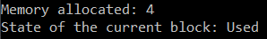
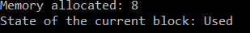
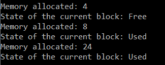
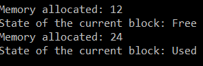

# Lab 1 - Allocator
=======


## info


An allocator is a specialized class that implements and encapsulates unimportant details of the allocation and release of computer memory resources.

The description of the implementation of the mechanics of a block allocator is that it divides some large piece of memory into smaller sections of the same size.
The block contains a header field and a chunk of memory that the allocator returns to the user. The header is 3 bytes long and contains information about the length of the block and whether it is busy.
When an allocation is requested, the locator simply returns one of the free chunks of memory of a fixed size, and when a free chunk is requested, it simply saves that chunk of memory for later use.

### Algorithm description

#### Allocate function
```
#Description of the PROTOTYPE algorithm: void * mem_alloc (size_t size)
```

When the user calls the mem_alloc function, the program scans the memory allocated during allocator initialization, looking for an unallocated block of memory of a suitable length. If no such block is found, it returns a NULL pointer.
### Reallocate function
```
#Description of the PROTOTYPE algorithm: void * mem_realloc (void * addr, size_t size)```

The function checks if there is a block of memory of a suitable size, and if there is one, then the function transfers data there or a part of it and acquires the address of a new block of memory, if there is no such block, the function returns NULL and does not destroy the old block of memory.


### Free memory function
```
#Description of the PROTOTYPE algorithm: void mem_free (void * addr)```

The corresponding addr block is removed from the list, added to the free list, and connected to adjacent free blocks, if any.

## HOW TO USE

To use the algorithm you need to download allocgead.h and laba1os.cpp and then run them with java application
## DEMONSTRATION

### Creation allocator

##### Code
```auto allocator = new AllocatorBlock();```


### The allocation of *4* bytes of memory
#### Block can contain only *4* bytes. We must join *1* blocks
##### Code
```
auto mem = allocator->mem_alloc(sizeof(long));
allocator->mem_dump();
```

##### Output


### The allocation of *6* bytes of memory
#### Block can contain only *6* bytes. We must join *2* blocks
##### Code

```
auto mem2 = allocator->mem_alloc(5);
allocator->mem_dump();
```

##### Output


---

### The reallocation of *23* bytes of memory
#### The function frees the addr memory block and applies it to it mem_alloc (size), where size is the new specified size in bytes
##### Code
```
auto mem_real = allocator->mem_realloc(mem, 23);
allocator->mem_dump();
```

##### Output

---
### The freeing of *6* bytes of memory
#### Optimize method split a large block into smaller for reuse
##### Code
```
allocator->mem_free(mem2);
allocator->mem_dump();
```

##### Output

---

###It just work =D###
